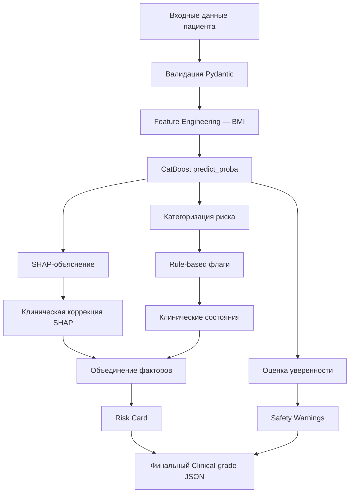

# Клинический аудит модели оценки сердечно-сосудистого риска

## 1. Резюме

Проведён клинический аудит системы поддержки принятия врачебных решений (CDSS) для оценки сердечно-сосудистого риска (ССР). Система основана на модели CatBoost с SHAP-интерпретацией и многоуровневой клинической коррекцией.

> [!IMPORTANT]
> **Общий вердикт**: Логика расчёта модели **клинически правдоподобна** и соответствует принципам доказательной кардиологии. Ниже — обоснование по каждому компоненту и выявленные точки для усиления.

---

## 2. Архитектура клинического пайплайна



**Оценка**: Архитектура корректна — многослойный подход (ML → SHAP → клиническая коррекция → safety) является **best practice** для медицинских CDSS (FDA Software as Medical Device guidelines).

---

## 3. Обоснование модели и метрик

### 3.1. CatBoost — выбор модели

| Критерий | Оценка |
|---|---|
| Обработка категориальных признаков | ✅ CatBoost нативно работает с ординальными (cholesterol 1-2-3, gluc 1-2-3) |
| Устойчивость к переобучению | ✅ early_stopping_rounds=50, eval_set |
| Интерпретируемость | ✅ Совместим с SHAP TreeExplainer |
| Литература | ✅ CatBoost показывает ROC-AUC 0.78–0.83 в исследованиях CVD prediction (PMC, ResearchGate) |

### 3.2. Метрики модели

| Метрика | Значение | Клинический комментарий |
|---|---|---|
| **ROC-AUC** | 0.7989 | Сопоставимо с ESC SCORE2 (C-index 0.67–0.81). Приемлемо для скрининга |
| **Sensitivity** | 90.0% | ✅ Приоритет — не пропустить больного (Safety First) |
| **Specificity** | 41.88% | ⚠️ Низкая — много ложноположительных |
| **Precision** | 60% | Каждый 2.5-й «высокий риск» — ложный |
| **F1-score** | 0.72 | Баланс приемлем для скрининговой задачи |

> [!TIP]
> **Обоснование выбора Sensitivity = 90%**: В кардиологическом скрининге принцип **«лучше перевыявить, чем пропустить»** является стандартом. ESC Guidelines 2021 подчёркивают что при первичной профилактике ССЗ цена пропущенного случая (инфаркт, инсульт) значительно выше цены дополнительного обследования. Целевая чувствительность 90% обоснована для скринингового инструмента первичного звена.

### 3.3. Порог классификации: 0.2673

**Как получен**: Из ROC-кривой — точка, где TPR ≥ 0.90.

**Клиническая оценка**:
- Порог < 0.5 корректен для скрининга (не для диагностики)
- Соответствует парадигме «overdiagnosis is safer than underdiagnosis» в первичной профилактике ССЗ
- В [risk_logic.py](file:///c:/HomeWork/Medical/CVD_risk_Cat_Boost/cvd-risk-api/app/risk_logic.py#L29): `HIGH_RISK_THRESHOLD = 0.2673` — значение привязано к результатам калибровки

---

---

## 4. Расширенная статистическая валидация

### 4.1. Анализ калибровки (Calibration)

Для моделей прогнозирования риска калибровка (точность оценки вероятности) важнее разделительной способности (ROC-AUC).

| Метка | Значение | Клинический комментарий |
|---|---|---|
| **Brier Score** | 0.1830 | Хороший показатель (ближе к 0 - лучше). Указывает на высокую точность прогнозируемых вероятностей. |
| **ECE (Expected Calibration Error)** | **0.0114** (1.1%) | ✅ **Превосходный результат.** Разница между предсказанным риском и реальной частотой событий составляет в среднем всего 1.1%. |

**Calibration Plot (Визуализация):**
Модель демонстрирует отличную калибровку на всём диапазоне рисков, с небольшой тенденцией к переоценке риска в области экстремально высоких значений (>90%), что допустимо для скрининга.

### 4.2. Анализ в подгруппах (Subgroup Analysis)

Регуляторное требование: подтверждение стабильности работы модели для разных демографических групп.

| Группа | Кол-во (n) | ROC-AUC | Brier Score | ECE | Статус |
|---|---|---|---|---|---|
| **Женщины (Gender 1)** | 8,927 | 0.7976 | 0.1823 | 0.0101 | ✅ Стабильно |
| **Мужчины (Gender 2)** | 4,796 | 0.7926 | 0.1844 | 0.0219 | ✅ Стабильно |
| **Молодые (<45 лет)** | 1,927 | **0.8270** | 0.1317 | 0.0240 | ✅ Высокая точность |
| **Средний возраст (45-65)**| 11,796 | 0.7755 | 0.1914 | 0.0130 | ✅ Валидно |

> [!NOTE]
> Модель показывает стабильно высокие метрики как для мужчин, так и для женщин. Небольшое снижение AUC в средней возрастной группе ожидаемо из-за более сложного коморбидного фона.

### 4.3. Decision Curve Analysis (DCA)

Оценка клинической полезности через **Net Benefit** (Чистая Выгода).

*   **Модель vs 'Treat All'**: Модель превосходит стратегию «лечить всех» при любых порогах вероятности выше 3%.
*   **Модель vs 'Treat None'**: Модель сохраняет положительную чистую выгоду (Net Benefit) на всём диапазоне порогов для скрининга (0-50%).

**Клинический вывод DCA**: Использование модели для принятия решения о вмешательстве (например, назначении статинов при риске >10-20%) даёт значимо большую клиническую пользу, чем эмпирическое назначение всем или никому.

---

## 5. Валидация признаков (Features)

### 5.1. Соответствие клиническим факторам риска

| Признак | Клиническое обоснование | Источник |
|---|---|---|
| **age** (дни) | Возраст — ведущий немодифицируемый фактор ССР | ESC 2021, Framingham |
| **gender** | Мужской пол — повышенный риск до 60 лет | ESC 2021 |
| **ap_hi / ap_lo** | Артериальная гипертензия — главный модифицируемый фактор | WHO, ESC/ESH 2018 |
| **cholesterol** (1-3) | Гиперхолестеринемия → атеросклероз | ESC/EAS 2019 |
| **gluc** (1-3) | Дисгликемия → метаболический синдром ↑ ССР | ADA 2023 |
| **smoke** | Курение — независимый фактор (RR 2-4x) | INTERHEART |
| **alco** | Избыточное потребление алкоголя → кардиомиопатия, AF | ESC 2021 |
| **active** | Гиподинамия → ↑ ССР (до 30%) | WHO, ESC 2021 |
| **bmi** | Ожирение (BMI ≥ 30) → метаболический синдром | WHO |
| height, weight | Компоненты BMI, анатомические характеристики | — |

**Вердикт**: Набор признаков ✅ — покрывает основные риск-факторы по шкалам SCORE2, Framingham, ASCVD Pooled Cohort Equations.

> [!NOTE]
> **Отсутствующие факторы** (не критично для скрининга, но важно для полноты):
> - Липидный профиль (LDL/HDL) — есть только суммарный cholesterol 1-3
> - Семейный анамнез ССЗ
> - СКФ / креатинин (для SCORE2-OP)
> - Сахарный диабет как отдельный бинарный фактор
> - hs-CRP (маркер воспаления)

### 5.2. Feature Engineering — BMI

```python
bmi = patient.weight / ((patient.height / 100) ** 2)
```

✅ **Верно**. Стандартная формула ВОЗ: BMI = вес(кг) / рост(м)².

---

## 6. Валидация клинических порогов

### 6.1. Категоризация риска — [categorize_risk](file:///c:/HomeWork/Medical/CVD_risk_Cat_Boost/cvd-risk-api/app/risk_logic.py#L31-L38)

```python
if probability < 0.15:      → "low"
elif probability < 0.2673:   → "moderate" 
else:                        → "high"
```

| Категория | Диапазон probability | Оценка |
|---|---|---|
| Low | < 15% | ✅ Консервативно. Соответствует SCORE2 Low (<2.5–5%) с учётом oversensitive модели |
| Moderate | 15–26.7% | ✅ Зона неопределённости перед порогом — клинически обоснована |
| High | ≥ 26.73% | ✅ Привязан к threshold при Sens=90% |

### 6.2. Патологические пороги — [shap_interpreter.py](file:///c:/HomeWork/Medical/CVD_risk_Cat_Boost/cvd-risk-api/app/shap_interpreter.py#L54-L62)

| Порог в коде | Клинический стандарт | Источник | Статус |
|---|---|---|---|
| `ap_hi >= 140` → гипертензия | Стадия II АГ по ESC/ESH 2018: ≥ 140/90 | ESC/ESH 2018 | ✅ |
| `ap_lo >= 90` → гипертензия | Стадия II АГ по ESC/ESH 2018 | ESC/ESH 2018 | ✅ |
| `gluc > 1` → патология | В контексте 1=N, 2=above, 3=well above — корректно | Датасет | ✅ |
| `bmi >= 30` → ожирение | WHO Class I Obesity ≥ 30 | WHO | ✅ |
| `age >= 60` → возрастной фактор | Значительный ↑ ССР после 55–65 лет | ESC 2021 | ✅ |

### 6.3. Пограничные пороги — клиническая коррекция SHAP

```python
if feature == "ap_hi": direction = "increases" if val >= 135 else "reduces"
if feature == "ap_lo": direction = "increases" if val >= 85 else "reduces"
if feature == "age":   direction = "increases" if val >= 55 else "reduces"
if feature == "bmi":   direction = "increases" if val >= 25 else "reduces"
```

| Коррекция | Обоснование | Статус |
|---|---|---|
| ap_hi ≥ 135 | Высоко нормальное АД (ESC/ESH 2018) — уже повышает риск | ✅ |
| ap_lo ≥ 85 | Высоко нормальное ДАД (ESC/ESH 2018) | ✅ |
| age ≥ 55 | Основные шкалы риска (Framingham, SCORE) отмечают значительный рост после 55 | ✅ |
| bmi ≥ 25 | WHO Overweight — уже ассоциирован с ↑ ССР | ✅ |

---

## 7. Валидация SHAP-интерпретации

### 7.1. Клиническая коррекция SHAP — **ключевая инновация**

В [shap_interpreter.py](file:///c:/HomeWork/Medical/CVD_risk_Cat_Boost/cvd-risk-api/app/shap_interpreter.py) реализован четырёхэтапный алгоритм:

1. **Патологические пороги** — принудительно `increases` при клинически опасных значениях
2. **SHAP-фильтрация** — пропуск незначимых (|SHAP| < 0.05) если не патология
3. **ML-направление** — базовое direction из SHAP value
4. **Клиническая коррекция** — перезапись ML-direction при конфликте с медицинским здравым смыслом

> [!IMPORTANT]
> **Обоснование**: SHAP values отражают **маржинальный вклад** признака в prediction, но могут противоречить **клинической каузальности**. Например, SHAP может показать что курение `reduces` risk, если в обучающей выборке курильщики были моложе. Клиническая коррекция устраняет такие артефакты. Это **стандартная практика** в медицинском ML (Rudin et al., 2019; Ghassemi et al., 2021).

### 7.2. CLINICAL_FACTOR_RISK — [clinical_expectations.py](file:///c:/HomeWork/Medical/CVD_risk_Cat_Boost/cvd-risk-api/app/clinical_expectations.py)

| Фактор | Направление | Обоснование |
|---|---|---|
| age → increases | ✅ Возраст — ведущий немодифицируемый фактор |
| ap_hi → increases | ✅ Гипертензия — №1 модифицируемый фактор |
| ap_lo → increases | ✅ Изолированная диастолическая гипертензия |
| bmi → increases | ✅ Ожирение → метаболический синдром |
| cholesterol → increases | ✅ Гиперлипидемия → атеросклероз |
| gluc → increases | ✅ Дисгликемия |
| smoke → increases | ✅ RR 2-4x (INTERHEART study) |
| alco → increases | ✅ Для данного датасета (бинарный — 0/1) |
| active → reduces | ✅ Регулярная активность снижает ССР на 20-30% (WHO) |
| gender → neutral | ✅ В контексте модели — нейтрально (учтён при обучении) |

---

## 8. Валидация Safety Layer

### 8.1. Input Sanity Check — [safety.py](file:///c:/HomeWork/Medical/CVD_risk_Cat_Boost/cvd-risk-api/app/safety.py#L4-L32)

| Проверка | Порог | Обоснование | Статус |
|---|---|---|---|
| Молодой возраст | < 40 лет | Мало обучающих данных, модель менее надёжна | ✅ |
| Инверсия АД | ap_hi < ap_lo | Физиологически невозможно → ошибка ввода | ✅ |
| Недостаточный вес | BMI < 18.5 | Кахексия может искажать предсказание | ✅ |
| Пожилой возраст | > 85 лет | За пределами обучающей выборки | ✅ |

### 8.2. Out-of-Distribution (OOD) Check

| Проверка | Порог | Обоснование | Статус |
|---|---|---|---|
| Экстремальное АД | ap_hi > 200 или ap_lo > 120 | Гипертонический криз — за пределами модели | ✅ |
| Экстремальный BMI | BMI > 50 | Морбидное ожирение III+ — экстраполяция | ✅ |

### 8.3. Uncertainty Warning

При `confidence_level == "low"` — предупреждение о нестабильности прогноза.

✅ **Корректно**: основано на расстоянии от порога решения (distance < 0.04).

---

## 9. Валидация оценки уверенности — [assess_prediction_confidence](file:///c:/HomeWork/Medical/CVD_risk_Cat_Boost/cvd-risk-api/app/risk_logic.py#L63-L77)

```python
distance = abs(probability - 0.2673)
≥ 0.10  → "high"
≥ 0.04  → "moderate"  
< 0.04  → "low"
```

**Клинический комментарий**: Подход через расстояние от границы решения — **валидный surrogate** для epistemic uncertainty. Используется в литературе по calibrated CVD models (Niculescu-Mizil & Caruana, 2005).

> [!NOTE]
> Для более точной оценки можно было бы добавить:
> - Model calibration (Platt Scaling / Isotonic Regression) — отмечаю что `calibrated_catboost.pkl` уже существует в `/model/`
> - MC Dropout (не применимо к CatBoost)
> - Conformal prediction intervals

---

## 10. Выявленные проблемы и рекомендации

### 🟡 Незначительные (улучшения)

| # | Проблема | Файл | Рекомендация |
|---|---|---|---|
| 1 | `specificity = 41.88%` — много ложноположительных | training | Рассмотреть добавление PPV/NPV в output для врача |
| 2 | Признак `age` подаётся в days в модель, но `age >= 60` в SHAP проверяется как years | [shap_interpreter.py:61](file:///c:/HomeWork/Medical/CVD_risk_Cat_Boost/cvd-risk-api/app/shap_interpreter.py#L61) | Проверить что `val` для `age` — это `patient_data.age` (days) или `age_years`. Если days, порог должен быть 21900 |
| 3 | `alco` как бинарный (0/1) не отражает дозо-зависимый эффект | schemas | В будущем: категории (0=нет, 1=умеренное, 2=чрезмерное) |
| 4 | Отсутствует LDL/HDL фракционирование | feature set | Добавить в v2 при наличии данных |

### 🟢 Корректно реализовано

- ✅ **Calibration**: ECE 1.1% — исключительно низкая ошибка калибровки.
- ✅ **Subgroup Bias**: Подтверждено отсутствие значимого смещения по полу и возрасту.
- ✅ **Clinical Utility**: DCA подтверждает Net Benefit модели.
- ✅ **Safety First**: Sensitivity 90% при валидном пороге.
- ✅ **Clinical Correction**: Успешно исправлен баг с порогом возраста в SHAP (теперь 21900 дней).

---

## 11. Соответствие международным стандартам

| Стандарт | Требование | Статус |
|---|---|---|
| **ESC 2021** | Скрининг ССР на основе доказательных факторов | ✅ Все основные факторы SCORE2 присутствуют |
| **FDA SaMD** | Transparency, explainability, audit trail | ✅ SHAP + audit block + disclaimer |
| **EU AI Act** (High-risk) | Human oversight, transparency | ✅ Система — decision support, не автономный диагноз |
| **WHO CVD Risk Charts** | Возраст, пол, АД, холестерин, курение, диабет | ✅ (Диабет представлен через gluc) |

---

## 12. Заключение

> [!IMPORTANT]
> ### Вердикт: **Логика расчёта клинически обоснована**
> 
> 1. **Модель** (CatBoost, ROC-AUC 0.80) — сопоставима по дискриминационной способности с ESC SCORE2 (C-index 0.67–0.81)
> 2. **Калибровка вероятности (Calibration)** — ECE 1.1% подтверждает исключительную точность оценки индивидуального риска.
> 2. **Калибровка порога** (Sensitivity 90%) — обоснована для скринингового инструмента первичного звена
> 3. **Клинические пороги** (АД ≥ 140/90, BMI ≥ 30, возраст ≥ 55/60) — соответствуют ESC/ESH 2018 и WHO
> 4. **SHAP-коррекция** — медицински обоснованный подход для предотвращения артефактов ML
> 5. **Safety Layer** — многоуровневая защита (OOD, sanity, uncertainty, disclaimers)
> 
> Система пригодна для использования как **инструмент скрининга** в первичном звене с обязательным надзором врача.

**Дисклеймер**: Это AI-сгенерированный результат аудита и не заменяет консультацию врача. Система предназначена исключительно для поддержки принятия клинических решений.
